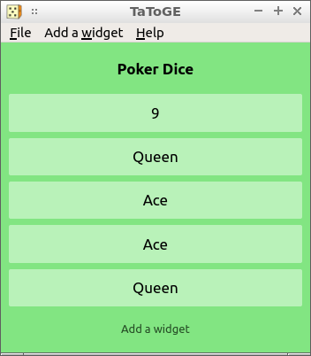
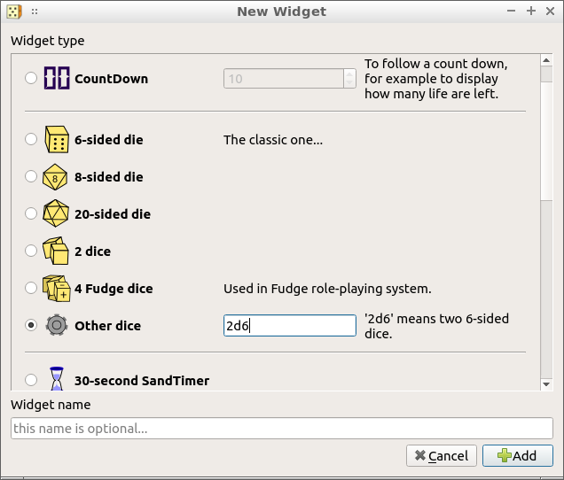
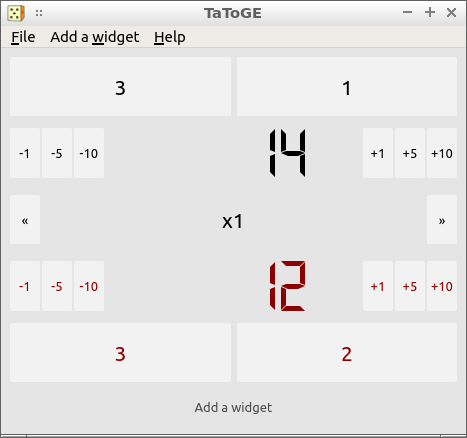

TaToGE permet de simuler les divers accessoires nécessaires pour jouer aux jeux de sociétés, de cartes ou aux jeux de rôles (Dés, sabliers, compteurs de score...), et de les regrouper sur un écran clair et épuré.

Ce logiciel se veut simple et générique, et peut être utilisé pour accompagner une "vraie" partie sur table.

## Utilisation typique

- Quand on a un matériel de jeu perdu ou manquant, ou si on veut reconstituer un jeu qu'on n'a pas.
- Quand lancer de vrais dés serait trop bruyant.
- Quand on a besoin d'un tirage aléatoire personalisé, par exemple pour choisir celui qui paye la tournée.
- Quand le maître du jeu veut un tableau de bord propre et paramétrable.
- Quand on veut diffuser un score sur un grand écran.

## Essayer

Vous pouvez simplement essayer [la version TaToGE web](https://quasart.github.io/TaToGE/web/) dans votre navigateur.

Sinon, une version executable en Qt peut être [téléchargée ici pour windows](https://github.com/quasart/TaToGE/releases/latest). Pour les autres plateforme supportées par Qt5, vous pouvez compiler le projet à partir du [code source](https://github.com/quasart/TaToGE).

N'hésitez pas à rapporter tous bugs, remarques ou idées dans la page [issue-tracking sur github](https://github.com/quasart/TaToGE/issues).

Le code source est disponible sous la licence [GNU GPL v3.0](https://www.gnu.org/licenses/gpl-3.0.en.html).

## Features

| Description                                            |  Qt   |  Web  |
|--------------------------------------------------------|:-----:|:-----:|
| Materiel de jeu virtuel :                              |       |       |
| - Sablier                                              |   ✔   |   ✔   |
| - Compteur                                             |   ✔   |   ✔   |
| - Dé                                                   |   ✔   |   ✔   |
| - Jeu de plusieurs dés                                 |   ✔   |       |
| - Suivi de séquence/compte à rebours                   |   ✔   |       |
| - Tirage de cartes                                     |   ✔   |       |
| Écran "responsive"                                     |   ✔   |   ✔   |
| Suppression/déplacement du matériel en cours de partie |       |   ✔   |
| Chargement d'une configuration de table depuis du Json |   ✔   |   ✔   |
| Sauvegarde de l'état de la table dans un fichier       |   ✔   |       |
| Internationalisation                                   | en,fr |  en   |

## Screenshots (version Qt)

